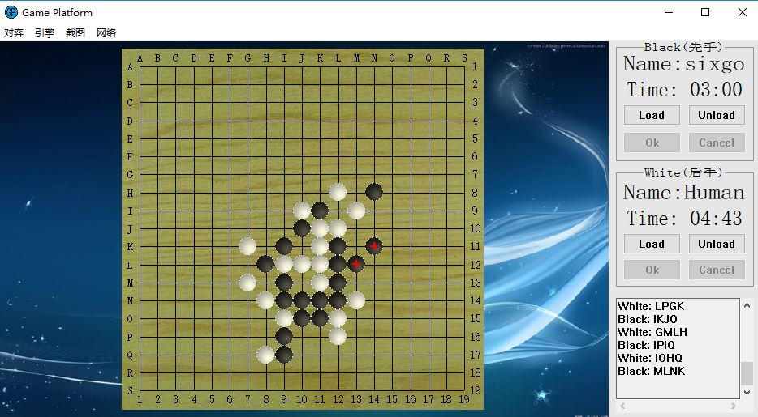

# SixtChessGo

**简介**

> 这是一个六子棋程序，针对一个公共博弈平台写的算法引擎，采用三维空间暴力搜索的方式对局面进行评估并决策

**对弈平台简介**

SAU通用计算机博弈对战平台与控制台类型博弈软件之间，依靠匿名管道技术与标准输入输出重定向技术来实现进程间通信，有效地对控制台类型博弈软件实现了技术屏蔽。控制台类型博弈程序只需要调用标准输入函数就可以接收到平台发送的命令，也只需要调用标准输出函数就可以向平台发送信息。

**平台与引擎之间的通信协议**

```txt
1、数据格式规定：博弈平台与博弈软件间通信的数据以字符串的形式进行传递，有效信息是 “command word+[' '+parameters]+'\n'”格式的命令串，即以命令字开头换行符结尾中间填充可选参数。对于平台，博弈软件发送的无效信息将被自动过滤。

2、数据长度规定：博弈平台与博弈引擎间通信的一条命令串长度不超过256字节（包括字符串结束符'\0'）。

3、棋盘坐标规定：二维棋盘分为横轴和纵轴两个维度，以左上角为坐标原点。因为棋盘范围不限定于0~9，为了压缩命令串的长度，以大写字母代替数字，故坐标从大写字母 'A'开始，按字母序进行标定。
4、平台-引擎通信协议定义有："name?","name","new","move","accept","refuse","take","taked","end","quit","error"十一个命令字。其中"name?","new","move","accept","refuse","take","taked","end","quit","error"为平台向引擎传递命令；"name","move"为引擎向平台传递命令字。在后面对命令串进行完整定义的描述中，以"["和"]"括起的参数为可选参数。

5、平台向引擎发送命令串定义

    1)"name?" 命令
        功能：
            询问引擎名称
        完整格式：
            "name?+'\n'"
        参数：
            无
        说明：
            "name?" 命令为无参命令，只能由平台向引擎发送。

    2)"new" 命令
        功能：
            创建对弈
        完整格式：
            "new+' '+side+'\n'"
        参数：
            side：用于指明引擎的执棋颜色，其值为black或white。
        说明：
            "new" 命令用于通知引擎创建新棋局。若side值为black，则引擎先手行棋，应向平台发送"move"命令。若side值为white，则引擎后手行棋，应等待引擎发送行棋通知，即"move"命令。

    3)"move" 命令
        功能：
            行棋通知
        完整格式：
            "move+[' '+position list]+'\n'"
        参数：
            position list：坐标列表。
        说明：
            "move" 命令用于通知引擎开始行棋，其参数为上一手棋的着法。坐标列表内坐标按字符位数进行区分，两个坐标之间不加空格符，两个字符构成一个坐标，第一字符表示横轴坐标，第二字符表示纵轴坐标。如幻影围棋类的非完备信息博弈，不可获知对方的行棋着法，则该命令不带参数。添子类棋种坐标列表内坐标数量等同于落子数量，每一个坐标表示一处棋子落点。走子类棋种坐标列表内坐标数量为行棋步数加一，其中第一坐标为棋子的起始坐标，最后坐标为棋子落点坐标，其余坐标为棋子的滞留坐标。如亚马逊棋需要设置障碍，则在坐标列表中添加一个障碍坐标。

    4)"accept" 命令
        功能：
            着法接受通知
        完整格式：
            "accept+'\n'"
        参数：
            无
        说明：
            用于幻影围棋中，确认平台接受引擎提交的着法。
        
    5)"refuse" 命令
        功能：
            着法拒绝通知
        完整格式：
            "refuse+'\n'"
        参数：
            无
        说明：
            用于幻影围棋中，确认平台拒绝引擎提交的着法。
        
    6)"take" 命令
        功能：
            提子通知
        完整格式：
            "take+' '+num+' '+position list+'\n'"
        参数：
            num：坐标列表内坐标数量。
            position list：坐标列表。
        说明：
            “take” 命令用于通知引擎进行提子。该命令用于幻影围棋类引擎不可推知何处棋子如何被移出棋盘的非完备信息博弈，其它类型博弈的提子或吃子操作皆可通过对“move” 命令的处理得出。

    7)"taked" 命令
        功能：
            被提子通知
        完整格式：
            "taked+' '+num+' '+position list+'\n'"
        参数：
            num：坐标列表内坐标数量。
            position list：坐标列表。
        说明：
            参考"take"命令。
        
    8)"end" 命令
        功能：
            通知对弈结束
        完整格式：
            “end+[' '+win]+'\n'”
        参数：
            win：获胜方，值为black或white。
        说明：
            “win” 命令参数可由可无，若含参数，则参数用以指定获胜方。

    9)"quit"命令
        功能：
            通知退出程序
        完整格式：
            “end+'\n'”
        参数：
            无
        说明：
            无

    10)"error" 命令
        功能：
            通知着法错误
        完整格式：
            “error+'\n'”
        参数：
            无
        说明：
            “error” 命令为无参命令，只能由平台向引擎发送。

6、引擎向平台发送命令串定义

    1)“name” 命令
        功能：
            应答引擎名称
        完整格式：
            “name+' '+engine name+'\n'”
        参数：
            engine name：引擎名称。
        说明：
            “name” 命令用于应答平台发出的 “name?” 命令。

    2)“move” 命令
        功能：
            应答行棋着法
        完整格式：
            “move+' '+position list+'\n'”
        参数：
            position list：着法列表。
        说明：
            “move” 命令用于应答平台发出的 “move” 命令和 “new black” 命令，position list参数规则参考平台向引擎发送的 “move” 命令说明。

7、补充说明

    在对弈进行过程中，平台只接受引擎发送的“move”命令，除非用户手动触发对博弈程序的特殊操作（如悔棋等）转换到对特殊命令的接收。
```
**算法思想**

本算法采取简单的三维空间暴力搜索的方式，棋力不如遗传算法或其他神经网络算法，优势当然就是棋力在整体上还算一般的情况下速度还行咯（手动滑稽）

算法由我对五子棋算法的抽象衍生而来。

首先抽象出一个三位坐标，X轴即是棋面的X方向，Y轴代表棋面的Y方向，而Z轴就要抽象一点了，代表整个六子棋的可赢的方式总数（六子棋在整个盘面的可赢的方式总数是可以穷举出来的），一旦某种赢法上面占据了一颗棋子，那么这种赢法的三维空间平面上对应的位置就会置为1（此处有点抽象，需要抽象出那个空间感出来），随后在作决策的时候，就会针对这个三维空间整体进行扫面，对各种赢法做出统计，当己方落棋的时候，就会寻找对己方最有利的那一种赢法，当然也不能这样说，因为对弈是双方的事情，即是说在对方威胁比较大的时候优先卡住对方的棋位，当对方威胁不大的时候，才选择己方利益最大化的位置进行落子。

就效果而言，我自己与我写的ai程序进行对弈，多数情况下都是输，原因是它“看到了”我“看不到的地方”，而针对棋力较强的神经网络算法而言，我的引擎棋力弱势就体现出来了（对方速度慢的让我心慌（^-^））

**示例对弈局面**

